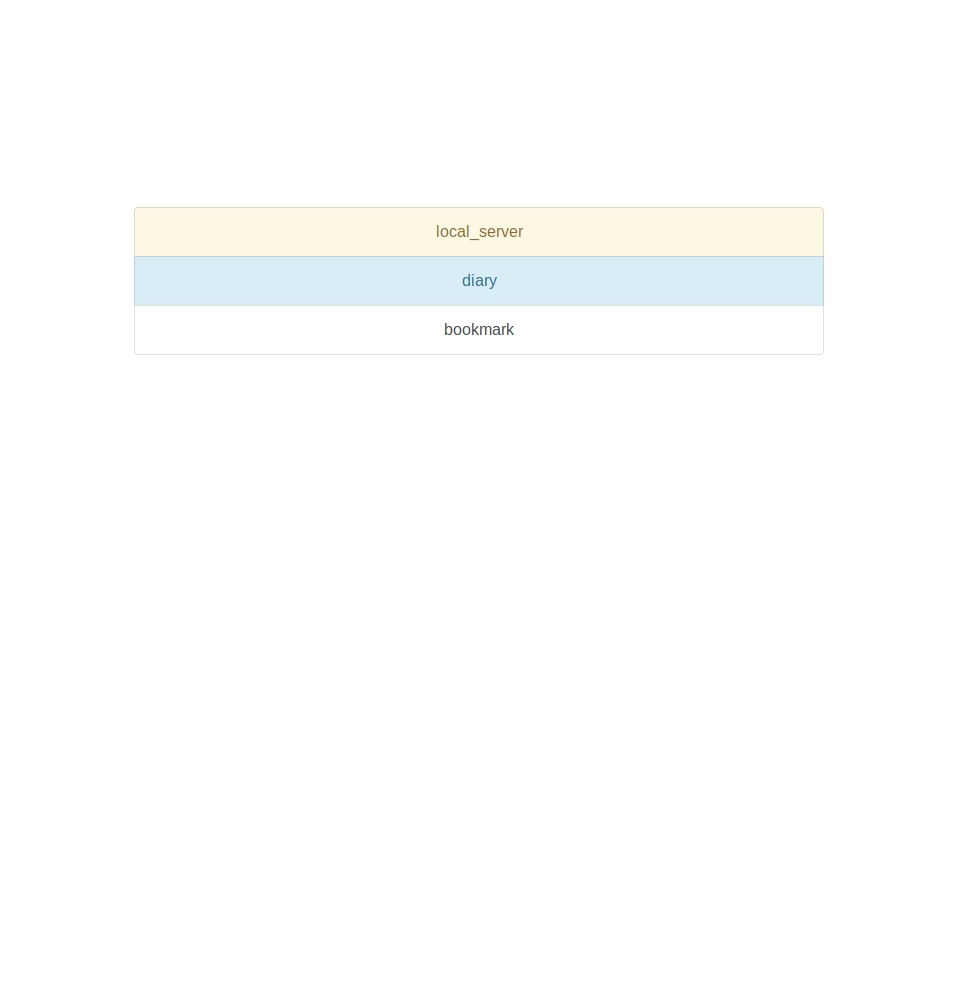
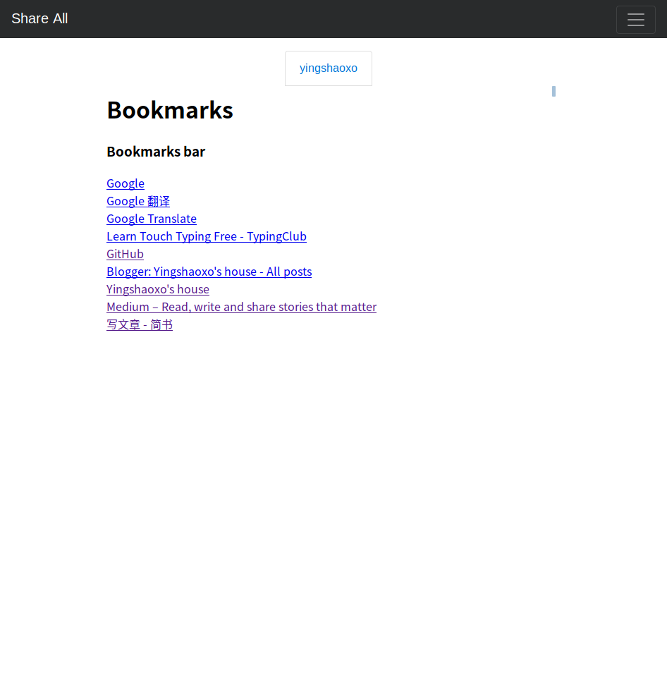

# This is a sharing place built by Django.

___

`local_server` is for local server forwarding. (you need [ngrok-tool](https://github.com/yingshaoxo/ngrok-tool) to make it work)

`diary` is for txt showing.

`bookmark` is for bookmarks sharing.

___

usage: `python3 manage.py runserver`

___

